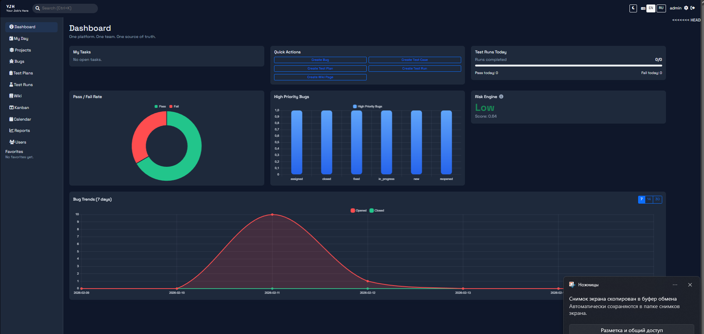

# YJH - "Your Job's Here" Quality Management Platform

YJH is an integrated QA platform that combines bug tracking, test management, wiki knowledge base, kanban, and release risk analytics in one lightweight PHP + SQLite stack.

## Why YJH
- One tool instead of Jira + TestRail + Confluence split.
- Fast local deployment (no heavy infra required).
- Built-in traceability: `test case -> execution -> bug -> commit`.
- Product-level QA features: Risk Engine, checklist-driven testing, auto bug creation, wiki versioning.

## 📦 Core Modules

### 🐛 Bugs Management
- `bugs.php` - List all bugs
- `bug.php` - View/Edit single bug
- `api/bugs.php` - Bugs API endpoints
- **Features:**
  - Create, edit, delete bugs
  - Status tracking (open/in progress/resolved/closed)
  - Priority & severity levels
  - Assignment to team members

### 📋 Test Management
**Test Plans**
- `testplans.php` - Manage test plans
- `testplan.php` - View/Edit test plan
- `api/testplans.php` - Test plans API

**Test Cases**
- `testcase.php` - Create/Edit test cases
- `api/testcases.php` - Test cases API

**Test Runs**
- `testruns.php` - Manage test executions
- `testrun.php` - View test run details
- `api/testruns.php` - Test runs API

### 📚 Wiki Documentation
- `wiki.php` - Wiki homepage
- `wiki-page.php` - View/Edit wiki pages
- `api/wiki.php` - Wiki API
- **Features:**
  - Version control for pages
  - Markdown support
  - Search functionality

### 📅 Team Calendar
- `calendar.php` - Team calendar view
- **Features:**
  - Add/Edit/Delete events
  - Sprint planning
  - Release scheduling
  - Team availability

### 🎯 My Day (Personal Dashboard)
- `myday.php` - Personal task dashboard
- **Features:**
  - Assigned bugs today
  - Upcoming test runs
  - Personal tasks
  - Recent activity

### 📊 Analytics & Reports
- `reports.php` - Analytics dashboard
- `assets/js/charts.js` - Charts & visualizations
- **Metrics:**
  - Bug trends
  - Test coverage
  - Team performance
  - Release readiness

### 🎨 Kanban Board
- `kanban.php` - Visual task board
- `api/kanban.php` - Kanban API
- **Features:**
  - Drag & drop tasks
  - Custom columns
  - Sprint tracking

### 🔧 User Management
- `settings.php` - User profile & settings
- `admin/users.php` - Admin user management
- **Features:**
  - Profile management
  - Role-based access (admin/user)
  - 2FA support
  - Activity logging

# YJH - "Your Job's Here" Quality Management Platform

YJH is an integrated QA platform that combines bug tracking, test management, wiki knowledge base, kanban, and release risk analytics in one lightweight PHP + SQLite stack.

## Tech Stack
- Backend: PHP (procedural MVC-style pages + API endpoints)
- Database: SQLite (`database.sqlite`)
- UI: Bootstrap 5 + Chart.js + custom JS
- Security: CSRF protection + server-side escaping helpers

## Screenshot

## Documentation
- Architecture: `docs/ARCHITECTURE.md`
- Database: `docs/DATABASE.md`
- API: `docs/API.md`
- Quick Start: `docs/QUICKSTART.md`
- Install: `docs/INSTALL.md`
- User Guide: `docs/USER_GUIDE.md`
- Features: `docs/FEATURES.md`
- Comparison: `docs/COMPARISON.md`
- Roadmap: `docs/ROADMAP.md`
- Why YJH: `docs/WHY_YJH.md`
- Visualizations: `docs/VISUALIZATIONS.md`
- Engineering Notes: `docs/ENGINEERING_NOTES.md`

## Quick Start
See `docs/QUICKSTART.md`.
